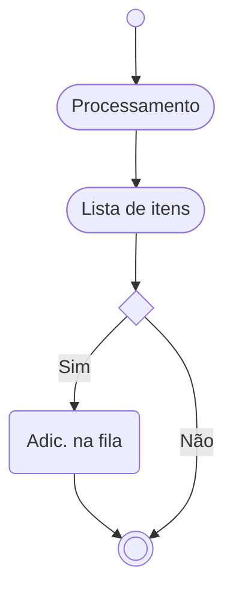

# ABAP parallel
 


 Paralelismo.

> 🗘 Este documento, assim como o negócio, está em constante fase de melhoria e adaptação.

 Usando uma interface standard SAP para fazer processamento em paralelismo. A interface de base será 
 Um dos links de referencia usados é [esse](https://sascha-dev.de/sap-entwicklung/parallelverarbeitung-unter-abap-mit-der-klasse-cl_abap_parallel/).


 ~~no momento, eu penso que seja uma boa ideia fazer disso um post no SAP Blogs, mas essa animação vai por agua em alguns dias~~


## Glossário

| Sigla | Significado | Descrição |
|-----|-----------|------------|
| BC |Business Consulting | ~~Find Clarity in Chaos~~ ABAP, Desenvolvedor SAP, Consultor ABAP, SAP DEV|
 FM | Function Module ||

## Fluxo da solução



### Processamento
```abap

write:/ 'Hello parallel' .

```

## Pontos de atenção 📝

- Quase ninguem fez isso, então, claro que nos (eu e ~~as vozes~~ os algortmos na minha cabeça) vamos fazer
- 
