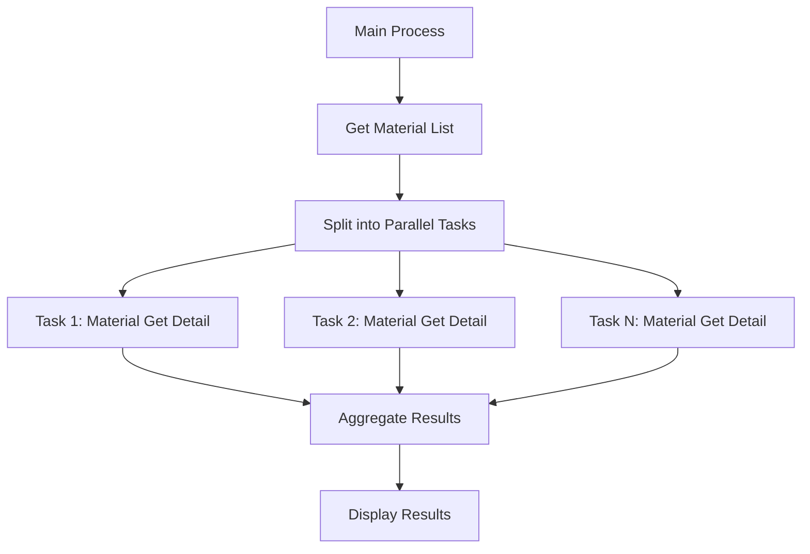

# ABAP Parallel Material Processing


<!--  -->


ABAP implementation for parallel processing of material data using `CL_ABAP_PARALLEL`. This solution demonstrates efficient batch processing of material master data with SAP BAPI integration.

## Features

- 🚀 Parallel data retrieval using ABAP Parallel Processing Framework
- 🔄 BAPI integration for material data operation (`BAPI_MATERIAL_GET_DETAIL`)
- ⚡ Configurable resource allocation (30% system resources in example)
- 📊 Batch processing of up to 30,000 materials
- 🛠️ Error handling with BAPI return messages
- 📈 Scalable architecture for enterprise-level material processing

## Installation

1. **Clone Repository**
   ```bash
   git clone https://github.com/edmilson-nascimento/abap_parallel.git
   ```
2. **Import to SAP System**
   - Use [abapGit](https://abapgit.org/) to import the repository
   - Activate all objects via SE80

## Usage

### Execute Report
Run transaction `SE38` and execute program `ZPARALLEL_MATERIAL_PROCESSING`

### Process Flow


### Key Methods
```abap
" Main execution method
CLASS main IMPLEMENTATION.
  METHOD process.
    " Parallel processing setup
    DATA(parallel) = NEW single_task( p_percentage = 30 ).
    parallel->run( ... )
  ENDMETHOD.
ENDCLASS.
```

## Configuration

### Resource Allocation
Adjust parallel processing resources in `main=>process`:
```abap
DATA(parallel) = 
  NEW single_task( p_percentage = 30 ) " 30% system resources
```

### Processing Modes
| Mode | Description              |
|------|--------------------------|
| 2    | Read Material Details    |

## Contributing

Contributions are welcome! Please follow these steps:
1. Fork the repository
2. Create your feature branch (`git checkout -b feature/AmazingFeature`)
3. Commit your changes (`git commit -m 'Add some AmazingFeature'`)
4. Push to the branch (`git push origin feature/AmazingFeature`)
5. Open a Pull Request

## License

Distributed under the MIT License. See `LICENSE` for more information.

<!-- ## Pontos de atenção 📝
- Quase ninguém fez isso, então, claro que nos (eu e ~~as vozes~~ os algoritmos na minha cabeça) vamos fazer -->

