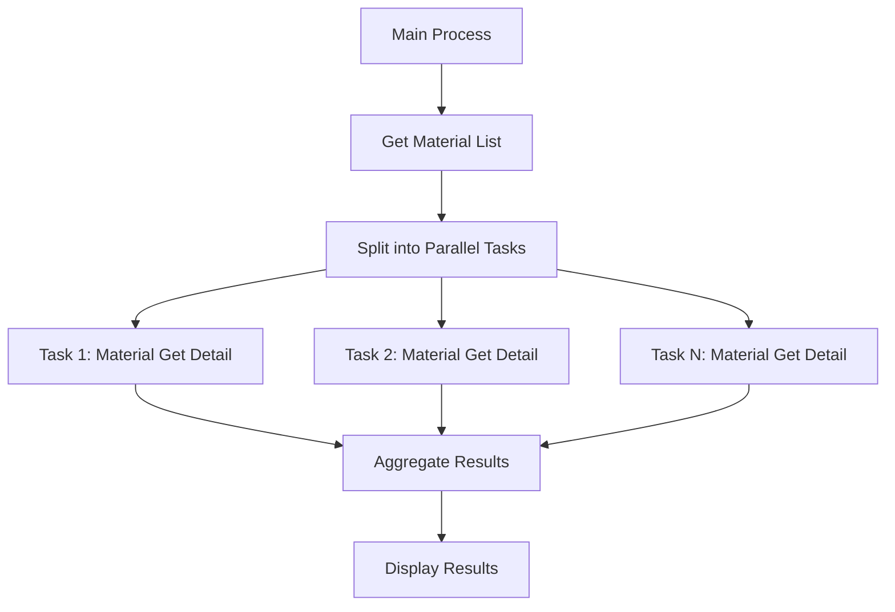

# ABAP Parallel Material Processing


<!--  -->


ABAP implementation for parallel processing of material data using `CL_ABAP_PARALLEL`. This solution demonstrates efficient batch processing of material master data with SAP BAPI integration.

## Features

- 🚀 Parallel data retrieval using ABAP Parallel Processing Framework
- 🔄 BAPI integration for material data operation (`BAPI_MATERIAL_GET_DETAIL`)
- ⚡ Configurable resource allocation (30% system resources in example)
- 📊 Batch processing of up to 30,000 materials
- 🛠️ Error handling with BAPI return messages
- 📈 Scalable architecture for enterprise-level material processing

## Installation

1. **Clone Repository**
   ```bash
   git clone https://github.com/edmilson-nascimento/abap_parallel.git
   ```
2. **Import to SAP System**
   - Use [abapGit](https://abapgit.org/) to import the repository
   - Activate all objects via SE80

## Usage

### Execute Report
Run transaction `SE38` and execute program `ZPARALLEL_MATERIAL_PROCESSING`

### Process Flow


### Key Methods
```abap
" Main execution method
CLASS main IMPLEMENTATION.
  METHOD process.
    " Parallel processing setup
    DATA(parallel) = NEW single_task( p_percentage = 30 ).
    parallel->run( ... )
  ENDMETHOD.
ENDCLASS.
```

## Examples
### Material Processing | Message application log

Resumo do exemplo
- Objetivo: demonstrar processamento paralelo de materiais com CL_ABAP_PARALLEL, gravando entradas no Message Application Log (ReCA) e exibindo um ALV com status por material.
- Fluxo alto nível:
  1. Seleção de materiais (MARA + MARC) via SELECT-OPTIONS do report.
  2. Criação de uma instância lcl_worker por material.
  3. Execução paralela das instâncias via cl_abap_parallel->run_inst (ex.: p_percentage = 30).
  4. Cada worker cria um registro no Message Application Log e faz commit.
  5. Agregação dos resultados e exibição em ALV (CL_SALV_TABLE).

Detalhamento das classes e métodos
- lcl_material_processor
  - execute(ir_matnr, ir_werks, iv_mtart OPTIONAL) -> tty_result
    - Orquestra o processamento: chama select_data, build_processes e run_parallel. Retorna tabela de resultados (matnr, werks, update_status, message).
  - select_data(ir_matnr, ir_werks) -> tty_material_data
    - SELECT com INNER JOIN entre MARA e MARC usando os ranges informados. Limite: UP TO 3000 ROWS.
    - Observação: iv_mtart declarado mas não utilizado — pode ser adicionado como filtro.
  - build_processes(it_data) -> cl_abap_parallel=>t_in_inst_tab
    - Cria NEW lcl_worker( is_data = ls_data ) para cada linha e CAST para IF_ABAP_PARALLEL.
  - run_parallel(it_processes) -> tty_result
    - Invoca NEW cl_abap_parallel( p_percentage = 30 )->run_inst( p_in_tab = it_processes ).
    - Itera o retorno (p_out_tab), faz CAST para lcl_worker e obtém resultados via get_result, agregando em resultado final.

- lcl_worker (implementa IF_ABAP_PARALLEL)
  - constructor(is_data)
    - Inicializa ms_data com os dados do material.
  - if_abap_parallel~do
    - Ponto de entrada executado em paralelo. Chama update_material e armazena o resultado localmente.
  - update_material() -> ty_result
    - Define estado inicial (icon_led_yellow), chama create_message, atualiza update_status para icon_led_green ou icon_led_red e preenche campo message com timestamp.
  - create_message(iv_matnr, iv_werks) -> sap_bool
    - Cria cf_reca_message_list, adiciona mensagem informativa e chama message_list->store.
    - Se store falhar retorna abap_off; em caso de sucesso retorna abap_on e executa BAPI_TRANSACTION_COMMIT WAIT = ABAP_TRUE.
    - Efeitos: persiste entrada no Application Log e comita localmente (atenção em execução paralela).

Resultado final apresentado
- ALV (CL_SALV_TABLE) exibindo colunas: MATNR, WERKS, UPDATE_STATUS (ícone: green/yellow/red), MESSAGE (texto).
- Significado dos ícones:
  - Verde: mensagem criada com sucesso e commit.
  - Amarelo: estado intermediário (inicial).
  - Vermelho: falha ao gravar o log.

Pontos de atenção e limitações
- SELECT tem UP TO 3000 ROWS — ajuste conforme necessidade (no README está mencionado 30.000, mas o código atual limita a 3.000).
- iv_mtart presente como parâmetro mas não usado no SELECT.
- Commits realizados por cada worker (BAPI_TRANSACTION_COMMIT) podem gerar concorrência ou implicar em comportamento indesejado em ambiente produtivo.
- Tratamento de erros é simplificado: message_list->store apenas retorna sem log detalhado; adicionar TRY/CATCH e logs estruturados é recomendado.
- Tipo do campo message no resultado é BAPI_MSG no código, porém o preenchimento atual usa string — validar tipo/formatos para exibição correta.

Recomendações de melhoria
- Utilizar iv_mtart como filtro no SELECT.
- Parametrizar UP TO N ROWS e p_percentage em runtime.
- Centralizar commits (ou usar commits controlados por lote) para reduzir impacto concorrencial.
- Adicionar TRY/CATCH dentro de if_abap_parallel~do e log de exceções.
- Normalizar o campo message (usar estrutura BAPI_MSG corretamente ou trocar para STRING se necessário).

Como executar o exemplo
1. No SAP: abrir SE38 e executar o report ZMATERIAL_UPDATE_PARALLEL.
2. Informar filtros em s_matnr e s_werks.
3. Executar; ao término o ALV mostrará o status por material e a mensagem criada no Application Log.

Exemplo rápido de chamada (no START-OF-SELECTION)
- lcl_material_processor=>execute( ir_matnr = s_matnr[] ir_werks = s_werks[] ).

## Configuration

### Resource Allocation
Adjust parallel processing resources in `main=>process`:
```abap
DATA(parallel) = 
  NEW single_task( p_percentage = 30 ) " 30% system resources
```

### Processing Modes
| Mode | Description              |
|------|--------------------------|
| 2    | Read Material Details    |

## Contributing

Contributions are welcome! Please follow these steps:
1. Fork the repository
2. Create your feature branch (`git checkout -b feature/AmazingFeature`)
3. Commit your changes (`git commit -m 'Add some AmazingFeature'`)
4. Push to the branch (`git push origin feature/AmazingFeature`)
5. Open a Pull Request

## License

Distributed under the MIT License. See `LICENSE` for more information.

<!-- 
## Pontos de atenção 📝
- Quase ninguém fez isso, então, claro que nos (eu e ~~as vozes~~ os algoritmos na minha cabeça) vamos fazer 
-->