# ABAP parallel
 


 Paralelismo.

> 🗘 Este documento, assim como o negócio, está em constante fase de melhoria e adaptação.

 Usando a interface standard SAP `cl_abap_parallel` para fazer processamento em paralelismo. A interface de base será 
 Um dos links de referencia usados é [esse](https://sascha-dev.de/sap-entwicklung/parallelverarbeitung-unter-abap-mit-der-klasse-cl_abap_parallel/).

~~no momento, eu penso que seja uma boa ideia fazer disso um post no SAP Blogs, mas essa animação vai por agua em alguns dias~~

https://www.sapignite.com/learn-parallel-processing-in-abap/

" Ref 
" https://community.sap.com/t5/application-development-blog-posts/using-class-cl-abap-parallel-for-mass-parallel-dialog-work-processes/ba-p/13579844


## Glossário

| Sigla | Significado | Descrição |
|-----|-----------|------------|
| BC |Business Consultant | ~~Find Clarity in Chaos~~ ABAP, Desenvolvedor SAP, Consultor ABAP, SAP DEV|
 FM | Function Module ||

## Fluxo da solução

```mermaid
%%{ init: { 'flowchart': { 'curve': 'basis' } } }%%
flowchart TB

    Begin((" ")):::startClass --> service-now([Processamento])
    service-now --> Atendimento-BC(["Lista de itens"])
    Atendimento-BC --> Q1{" "}

    Q1 -- Sim --> Quermesse("Adic. na fila") 
            --> End
    Q1 -- Não -->

End(((" "))):::endClass
```



### Processamento
```abap

write:/ 'Hello parallel' .

```

## Pontos de atenção 📝

- Quase ninguém fez isso, então, claro que nos (eu e ~~as vozes~~ os algoritmos na minha cabeça) vamos fazer


Here's a comprehensive README.md for your repository:

# ABAP Parallel Material Processing


ABAP implementation for parallel processing of material data using `CL_ABAP_PARALLEL`. This solution demonstrates efficient batch processing of material master data with SAP BAPI integration.

## Features

- 🚀 Parallel data retrieval using ABAP Parallel Processing Framework
- 🔄 BAPI integration for material data operations (`BAPI_MATERIAL_GET_DETAIL`, `BAPI_MATERIAL_SAVEDATA`)
- ⚡ Configurable resource allocation (30% system resources in example)
- 📊 Batch processing of up to 30,000 materials
- 🛠️ Error handling with BAPI return messages
- 📈 Scalable architecture for enterprise-level material processing

## Installation

1. **Clone Repository**
   ```bash
   git clone https://github.com/edmilson-nascimento/abap_parallel.git
   ```
2. **Import to SAP System**
   - Use [abapGit](https://abapgit.org/) to import the repository
   - Activate all objects via SE80

## Usage

### Execute Report
Run transaction `SA38` and execute program `ZPARALLEL_MATERIAL_PROCESSING`

### Process Flow


### Key Methods
```abap
" Main execution method
CLASS main IMPLEMENTATION.
  METHOD process.
    " Parallel processing setup
    DATA(parallel) = NEW single_task( p_percentage = 30 ).
    parallel->run( ... )
  ENDMETHOD.
ENDCLASS.
```

## Configuration

### Resource Allocation
Adjust parallel processing resources in `main=>process`:
```abap
DATA(parallel) = NEW single_task( p_percentage = 30 ) " 30% system resources
```

### Processing Modes
| Mode | Description              |
|------|--------------------------|
| 2    | Read Material Details    |

## Contributing

Contributions are welcome! Please follow these steps:
1. Fork the repository
2. Create your feature branch (`git checkout -b feature/AmazingFeature`)
3. Commit your changes (`git commit -m 'Add some AmazingFeature'`)
4. Push to the branch (`git push origin feature/AmazingFeature`)
5. Open a Pull Request

## License

Distributed under the MIT License. See `LICENSE` for more information.

```

This README includes:
1. Status badges for quick project overview
2. Visual workflow diagram using Mermaid.js
3. Clear installation and usage instructions
4. ABAP code snippets in proper formatting
5. Configuration reference table
6. Contribution guidelines
7. License information

The Mermaid diagram visually explains the parallel processing flow, while the badges provide quick project status information. The code blocks are properly formatted for ABAP syntax, and the table helps understand processing modes.